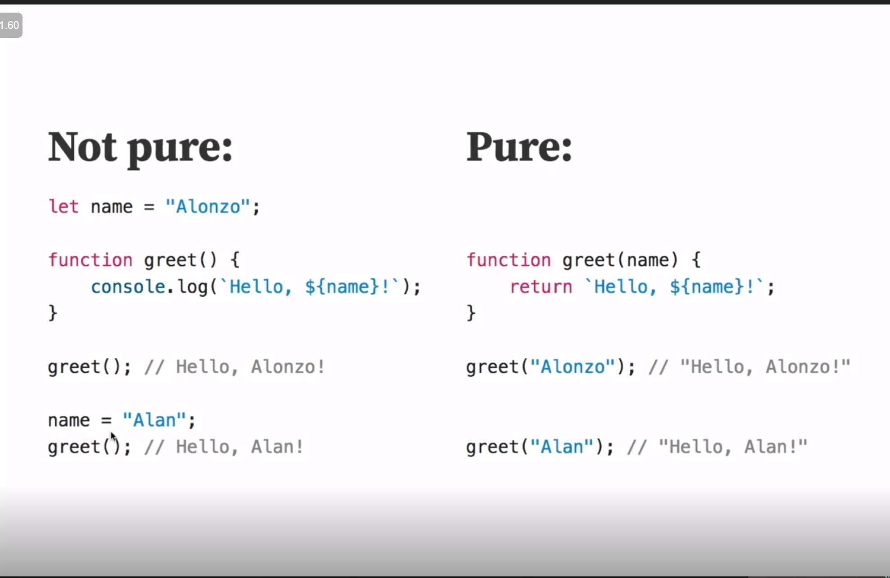

# Functional Programming (in JavaScript)

This is a collection of resources for learning functional programming.  This is derived from Frontend Masters course of the same name.

## What is Functional Programming

Functional programming is a programming paradigm that treats computation as the evaluation of mathematical functions and avoids changing-state and mutable data.  A paradigm is a way of thinking about programming, and functional programming is one of many paradigms.  Other types of programming paradigms include object-oriented programming, imperative programming, declarative, and logic programming.

Functional programming boils down to one simple idea, functions should be pure.  A pure function is a function that, given the same input, will always return the same output and does not have any observable side effect.

Pure functions - Only input in, only output out

## Pure Functions

- Every time you call a pure function with the same input, you'll get the same output, because the function depends on no outside variables, only on what is passed in.
- Notice in the image below, how the impure function is called the same way, but the output is different.  This is because the impure function depends on a variable outside of the function, which can change
- Notice also how the impure function has no input and no output (It console.logs rather than returns).  This is because the impure function has a side effect, which is to change the state of the world (in this case, the console)
  - 

## Why Functional Programming

- Functional programming is declarative rather than imperative, and declarative code is generally easier to reason about than imperative code.
- Easier to test and debug
- Good for data transformation
- OOP is good for modeling real-world things that have identity, but FP is good for modeling things that don't have identity, like data transformations
- Established community and tooling

## Side Effects

- A side effect is a change of system state or observable interaction with the outside world that occurs during the calculation of a result.
- Side effects are produced any time a function depends on or manipulates data outside of its scope.
- Pure functions do nothing except return output based on their input.  They do not depend on or manipulate data outside of their scope.